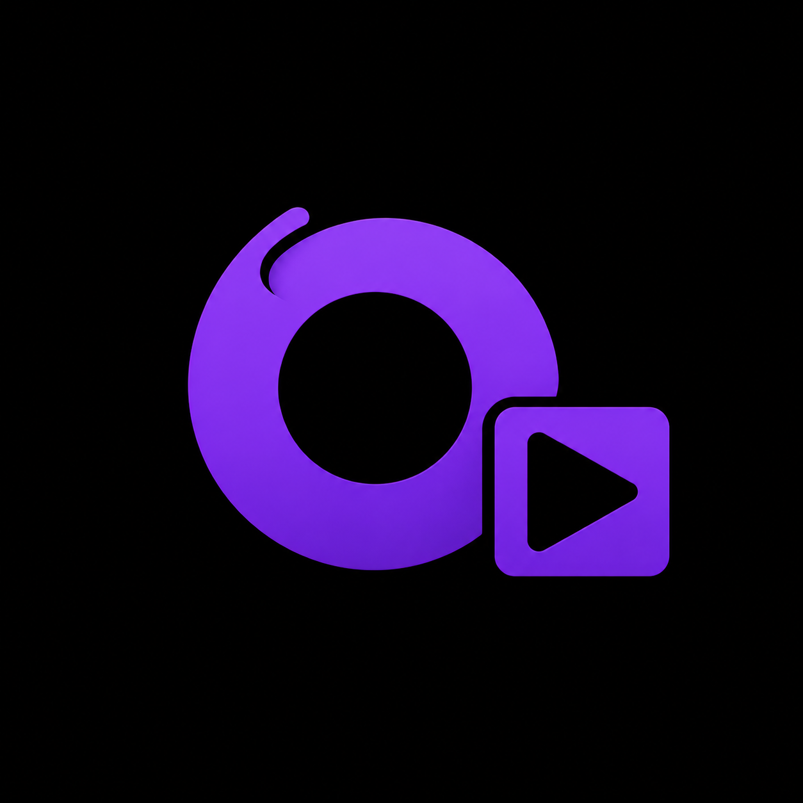
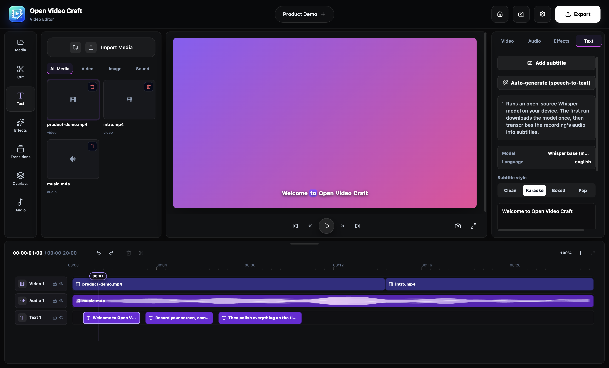
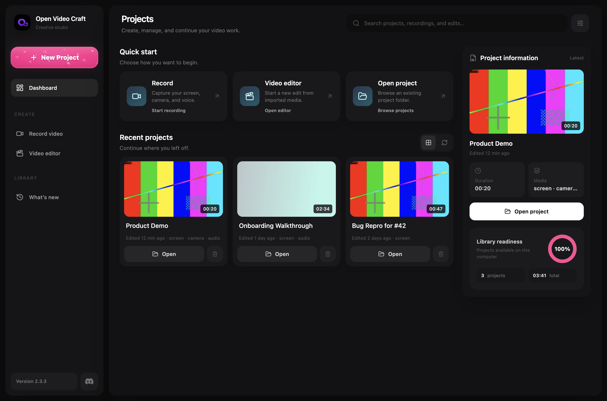
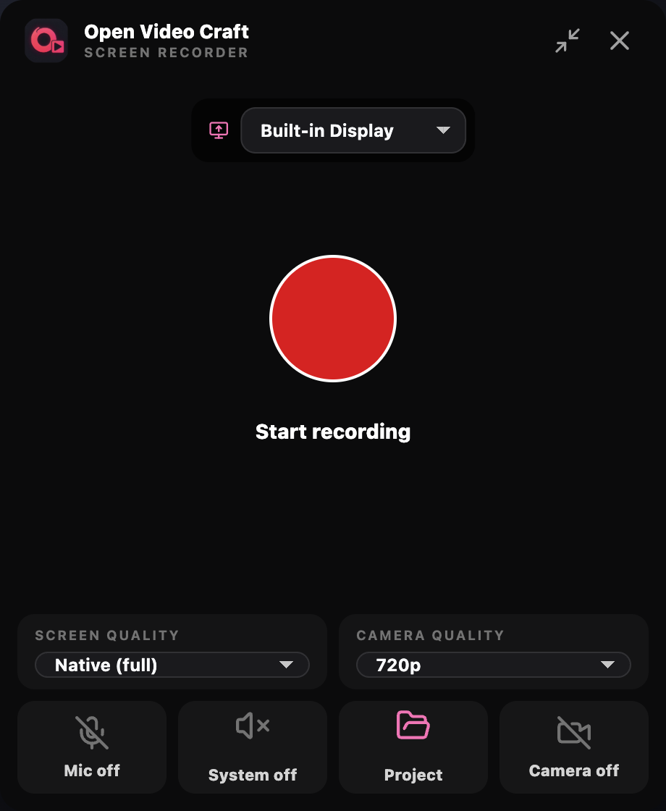
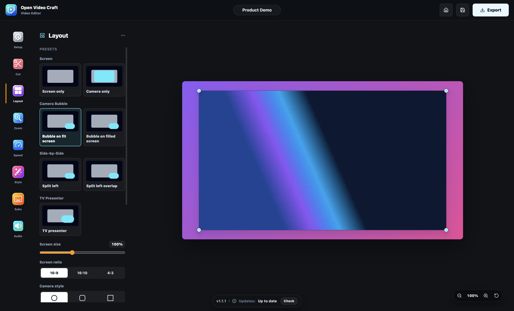

<div align="center">



# Open Video Craft

**Record your screen, camera, and audio — then cut, mix, subtitle, and export locally. No required account or upload.**

[**Download Open Video Craft for macOS or Windows →**](https://github.com/Reubencfernandes/Open-Video-Craft/releases/latest)

[](https://github.com/Reubencfernandes/Open-Video-Craft/releases/latest)
[](#development)
[](#development)

</div>



## What it does

Open Video Craft is a desktop screen studio in two parts:

1. **A floating recorder** captures your selected display with optional camera,
   microphone, and **system audio** tracks — each saved as its own file inside a
   plain project folder you can open, move, or back up like any other folder.
2. **A timeline editor** opens the recording (or any imported media) for
   editing: cut, move, trim, copy/paste, zoom-in effects, speed ramps,
   AI-generated subtitles, camera layouts, backgrounds, and dB-based audio
   mixing. FFmpeg exports MP4, WebM, or MOV, and subtitles can be written as a
   synchronized `.srt` sidecar.

Recording, editing, Whisper transcription, and export run locally. Optional
Gemini, Cohere, and Claude Code connections are used only when you explicitly
invoke their AI features.

## Screenshots — v1.0.2

| Launcher | Floating recorder |
| :---: | :---: |
|  |  |

| Editor workspace | Timeline & subtitles |
| :---: | :---: |
|  |  |

### Latest improvements

- The projects dashboard now gives recent projects more room, waits for real
  thumbnails instead of flashing placeholder artwork, and keeps the latest
  recordings one click away.
- The floating recorder has a camera-first preview, an opaque recording timer,
  clearer controls, and a compact mode that stays out of the captured content.
- Timeline clips have a stronger selected state, Space consistently controls
  playback across editor panels, and drag-selection no longer outlines the
  whole timeline.
- Whisper, Gemini, and Cohere subtitle generation now expose consistent
  timeline processing states. On-device Whisper auto-detects the spoken
  language, while readable errors and retry guidance replace raw provider
  payloads.
- Subtitle cues stay sorted by their timeline position, send a fast red laser
  beam between cues, highlight the active cue in red, and keep start/end
  timestamps read-only because timing is adjusted by dragging or trimming the
  timeline clip.
- AI prompts can be copied, concurrent requests are guarded cleanly, and Gemini
  errors are presented as concise messages instead of IPC implementation text.
- The export dialog is wider and more compact, video corners now offer clear
  Flat, Slight, and Rounded choices, and selected clips remain
  visible over bright filmstrip frames.

## Features

### Recording

- Floating always-on-top recorder with pause/resume, countdown, and a compact pill mode.
- Screen, camera, microphone, and **system/desktop audio** as separate tracks.
- The selected display is identified inside the recorder without placing a
  display-sized overlay over macOS or Windows.
- Media is written to disk in chunks while you record, limiting data loss after
  an interrupted recorder session.
- Recorder-renderer crashes and failed device acquisition are handled without
  wedging the active app session.

### Editing

- Multi-lane timeline: video, audio lanes, zoom, speed, and subtitle tracks.
- Export-correct crossfade, fade-through-black, slide-left, and wipe-left clip transitions.
- Move, trim, split, delete, and **copy/paste clips** — with undo/redo.
- Horizontal timeline zoom and a resizable timeline panel.
- Zoom-in effects with an adjustable focal point; speed sections up to 5×.
- Camera layouts (bubble, side-by-side, presenter…), draggable/resizable
  screen and camera, backgrounds and corner styling.
- **Multilingual on-device Whisper subtitles** with automatic language
  detection and word-level karaoke highlighting, plus draggable and trimmable
  subtitle clips with millisecond-accurate read-only timestamps in the cue list.
- Per-lane mute and volume controls with the same mix used for preview,
  transcription, and export; background music drops straight onto the timeline.
- Debounced autosave, dirty-state close protection, and safe recovery from an
  invalid or unsupported `editor.json`.
- Export to MP4 / WebM / MOV at source, 720p, 1080p, or 1440p, with microphone,
  system audio, background audio, per-track levels, and optional `.srt` subtitles.
- Connect Claude Code through the built-in local MCP server or Gemini with an
  API key so an AI agent can inspect and edit the complete project surface.

> **Current project-timeline export scope:** timeline cuts, reordered clips, clip transitions,
> intentional gaps, resolution, source/system/microphone/imported audio,
> gain/mute settings, zoom and speed effects, text animations, and clean
> burned-in or sidecar subtitles are exported. Camera compositing, visual
> layouts/backgrounds, and advanced subtitle styles remain preview-only.

### AI editing with Gemini or Claude Code

For module boundaries, revision/locking behavior, data flow, privacy guarantees,
and extension guidance, see [AI integration architecture](docs/AI_INTEGRATION.md).

Open a saved project and select **AI** in the editor top bar. Gemini uses an API
key encrypted on this computer, while Claude Code connects through the bundled
user-scoped `open-video-craft` stdio MCP server.

The agent can analyze speech, silence, and periodic contact-sheet frames
locally, then commit a complete edit request as one validated operation plan
with one-click rollback. Gemini uploads the current video only when you send an
assistant request. Timeline metadata, transcripts, and contact-sheet images
requested by a connected provider are handled under that provider's data policy.

### Keyboard shortcuts

| Action | macOS | Windows |
| --- | --- | --- |
| Play / pause | `Space` | `Space` |
| Seek 1 s / 10 s / 60 s | `←→` / `⇧←→` / `⌘←→` | `←→` / `Shift ←→` / `Ctrl ←→` |
| Copy / cut / paste clip | `⌘C` / `⌘X` / `⌘V` | `Ctrl C` / `Ctrl X` / `Ctrl V` |
| Split clip at playhead | `⌘B` | `Ctrl B` |
| Delete selected | `⌫` | `Delete` |
| Undo / redo | `⌘Z` / `⇧⌘Z` | `Ctrl Z` / `Ctrl Y` |
| Export | `⌘E` | `Ctrl E` |
| Toggle Chromium DevTools | `OVC_ENABLE_DEVTOOLS=1` + `Ctrl Shift I` | `F12` or `Ctrl Shift I` |

## Download and install

Grab the latest installer from the
[**Releases page**](https://github.com/Reubencfernandes/Open-Video-Craft/releases/latest):

- **macOS** — `.dmg` (Apple Silicon and Intel; signed and notarized)
- **Windows** — x64 Setup and Portable `.exe` builds. Version 1.0.2 is unsigned,
  so Windows may display a SmartScreen warning during installation.

The downloadable installers are attached directly to that release.
`SHA256SUMS.txt` is an optional integrity check for those files; it is not a
substitute for the installer downloads.

The bundled GPL FFmpeg executables have a matching
[source-code offer](FFMPEG_SOURCE_OFFER.md). Starting with v1.0.2, each release
publishes its verified FFmpeg source and build-provenance bundle beside the app
installers.

Packaged builds check for updates on startup and every four hours; updates
download in the background and install on quit.

> **macOS permissions:** the first recording asks for Screen Recording (and
> optionally Camera/Microphone) in System Settings → Privacy & Security. The
> app walks you through it.

## Project folder shape

Every recording is a normal folder — no databases, no proprietary formats:

```txt
my-recording-project/
  project.json      # recording metadata
  editor.json       # saved editor state (timeline, effects, subtitles…)
  edits.json
  subtitles.json
  imports/          # media you imported into the editor
    <asset-id>.ext
  media/
    screen.webm
    camera.webm
    mic.webm  mic.wav
    system.webm  system.wav   # system audio, when enabled
  exports/          # videos exported by an AI agent
  .ovc/             # disposable analysis cache, locks, and bounded AI history
```

Paths are relative, so a project keeps working after moving folders or machines.

## Development

```sh
npm install
npm run dev        # Vite + Electron with hot reload

npm run typecheck  # main + renderer TypeScript
npm test           # vitest unit tests
npm run build      # production build
npm run test:mcp   # bundled MCP server smoke test
```

Built with Electron 43, React, TypeScript, Vite, and Tailwind CSS. A verified
FFmpeg executable is bundled for remuxing, audio conversion, and export; its
license, source, and build provenance are recorded in
[Third-party notices](THIRD_PARTY_NOTICES.md).

The screenshots above were captured from the running desktop app during the
v1.0.2 release check. They document the actual launcher, recorder, editor, and
subtitle timeline rather than design mockups.

## Releases

Releases are tag-triggered: pushing a `v*` tag that matches `package.json`
builds and publishes the release-approved platform matrix through GitHub
Actions. Version 1.0.2 publishes macOS Intel/Apple Silicon and Windows x64
builds.

The public stable line remains 1.x: v1.0.2 follows the published v1.0.1 build.
Earlier 2.x tags were beta-test builds and are not used for this stable release.

```sh
npm run dist:win           # local Windows build
npm run dist:mac           # local macOS build (signed + notarized)
npm run verify:mac-release # required shipping gate for macOS artifacts
npm run verify:windows-release # required shipping gate for Windows artifacts
```

macOS release builds need a Developer ID Application certificate and one of
these notarization credential groups:

- `APPLE_ID`, `APPLE_APP_SPECIFIC_PASSWORD`, `APPLE_TEAM_ID`
- `APPLE_API_KEY`, `APPLE_API_KEY_ID`, `APPLE_API_ISSUER`
- `APPLE_KEYCHAIN_PROFILE` (optionally `APPLE_KEYCHAIN`)

Windows release signing can use `WINDOWS_CSC_LINK` (a base64 certificate or
secure certificate URL) and `WINDOWS_CSC_KEY_PASSWORD`. Those secrets are not
currently configured, so v1.0.2 Windows artifacts are published unsigned and
are labeled accordingly in the release notes.

The GitHub macOS artifacts are direct-download Developer ID builds. A future
Mac App Store submission requires a separate sandboxed `mas` target, App Store
entitlements, Store-managed updates, and a fresh review of bundled-code license
compatibility; this release does not claim Mac App Store readiness.

`verify:mac-release` validates the updater ZIP: `latest-mac.yml` checksum,
Developer ID team, designated requirement, strict signature, and the stapled
notarization ticket. Ad-hoc builds (`npm run dist:mac:adhoc`) are for local
testing only and must never be published as release assets.

## License

ISC © Reuben Chagas Fernandes. Bundled dependencies remain under their own
licenses; see [Third-party notices](THIRD_PARTY_NOTICES.md).
