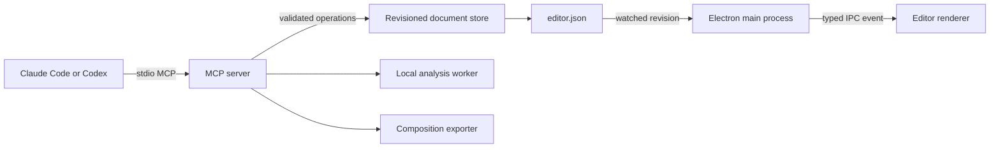

# AI video-editing integration

This document explains how Claude Code and Codex control Open Video Craft without
receiving direct filesystem or shell access from the application.

## Architecture

The integration is split across four process boundaries. Each boundary has a
small API and validates data before passing it onward.



### Shared domain

`src/shared/editor-domain.ts` is the public import barrel. Its implementation is
split by responsibility:

- `editor-domain/types.ts` contains only serializable TypeScript contracts.
- `editor-domain/schema.ts` creates defaults, migrates schema-v1 documents, and
  validates untrusted runtime data.
- `editor-domain/operations.ts` implements timeline geometry and applies a
  complete edit plan to a cloned snapshot.

Keeping this layer free of Electron, Node-only, React, and MCP dependencies lets
the renderer, main process, MCP server, exporter, and tests use exactly the same
document definition.

### Persistence and concurrency

`src/main/editor-document-store.ts` owns all writes to `editor.json`.

1. Acquire `.ovc/editor.lock` and recover it only when it is stale.
2. Re-read the document while holding the lock.
3. Compare the caller's base revision to the saved revision.
4. Reject agent edits while the renderer reports unsaved local changes.
5. Validate the complete next document.
6. Checkpoint agent changes under `.ovc/history/`.
7. Atomically replace `editor.json` and release the lock.

An edit plan is one transaction and therefore one undo action. Only the newest
agent edit can be undone; this prevents restoring an old checkpoint over newer
work.

### MCP adapter

`src/mcp/server.ts` is the provider-neutral stdio entry point. It translates MCP
resources and tools into calls to the domain services. It never accepts a raw
project path: `src/mcp/project-catalog.ts` resolves IDs only from Open Video
Craft's recent-project library and verifies each project manifest.

MCP tools fall into three groups:

- Inspection: `list_projects`, `inspect_project`, and `get_analysis`.
- Background work: `start_analysis`.
- Mutations: `apply_edit_plan`, `undo_agent_edit`, and `export_project`.

Every mutating request includes a saved revision. Stale requests fail and the
agent must inspect the project again before retrying.

`apply_edit_plan` is also request-scoped. The caller must include the original
`userRequest`, the exact `requestedActions` categories used by its operations,
and an editing basis. The server rejects missing, duplicate, or unused action
categories. This keeps “remove pauses” from silently becoming permission to add
zoom, speed, captions, transitions, or other generic cleanup.

Content-aware plans use `editingBasis.mode = "analysis-guided"` and must provide
the fingerprint returned by the latest analysis. A direct plan is reserved for
explicit user-provided timing or structure and must explain why analysis is not
needed.

### Local analysis

`src/main/editor-analysis.ts` coordinates analysis jobs and caches their result
under `.ovc/analysis/`. FFmpeg performs audio conversion, silence detection, and
contact-sheet generation. The Whisper model runs locally in the MCP process.

The result maps each contact-sheet tile to timeline timestamps and returns
filler-word candidates alongside the transcript and silence ranges. These are
review candidates only: the server instructions explicitly forbid treating a
detection as permission to remove content.

The tool returns a job ID immediately. Agents poll with `get_analysis`, avoiding
long MCP calls while transcription or image generation is in progress.

### Composition export

`src/main/composition-export.ts` converts an editor document into media sources
and calls the FFmpeg composition functions in `src/main/ffmpeg.ts`. The exporter:

- trims each segment from its source offset;
- normalizes video dimensions and frame rate;
- inserts black frames for intentional gaps;
- renders fixed-duration crossfade, fade-black, slide-left, and wipe-left transitions;
- renders smooth focus-point zoom regions;
- retimes video, mixed audio, and subtitle cues through speed regions;
- concatenates the resulting video segments;
- trims, delays, gains, and mixes source audio;
- applies the saved export range; and
- burns subtitles, writes a sidecar, or disables them.

Camera, layout, and advanced subtitle styles are reported as unsupported by
export instead of silently claiming they were rendered. Zoom and speed are
supported as MCP editor operations, appear live in the timeline, render in the
composition export, and can be undone with the rest of the agent's atomic edit.

### Clip transitions

Transitions are stored as references to two adjacent video segment IDs rather
than as arbitrary filter text. `editor-domain/operations.ts` requires both
clips to meet at one cut, limits duration to 0.1–2 seconds, and ensures a short
middle clip is not consumed by its incoming and outgoing transition handles.

The renderer's `TransitionPanel.tsx` edits this metadata and the timeline shows
a marker centered on the cut. Manual clip moves, trims, splits, and deletions
discard only transition references that are no longer valid. MCP callers use
`set_transition` and `remove_transition`, which remain part of the surrounding
atomic edit plan.

The FFmpeg composer keeps the timeline duration fixed: it blends the outgoing
clip's final half-window with the incoming clip's first half-window and fades
embedded clip audio at the same boundary. This prevents transition edits from
shifting subtitles, independent audio, or the export range.

### Desktop connection and synchronization

`src/main/ai-connection.ts` detects each CLI, checks MCP command support, and
adds or removes the user-scoped server configuration. The configured command
uses the packaged Electron executable with `ELECTRON_RUN_AS_NODE=1`, so a
separate Node.js installation is not required.

The renderer UI is composed from:

- `AiConnectionDialog.tsx`, which owns status and connection actions;
- `AiProviderConnectionCard.tsx`, which renders one provider; and
- `AiLastEditCard.tsx`, which renders checkpoint-backed undo.

`useEditorPersistence.ts` tracks local dirty state and saved revision. Electron
watches `editor.json`; a clean renderer applies newer external revisions live,
while a dirty renderer rejects them and explains the conflict.

## Privacy and trust boundaries

- Raw video is not returned through MCP.
- Analysis is local, but requested transcripts, timeline metadata, and contact
  sheets enter the connected provider's context.
- The UI requires a one-time acknowledgement before configuration.
- No provider API keys are stored.
- There is no arbitrary JSON replacement, shell tool, or arbitrary path input.

## Adding an edit operation

An operation is not complete until every layer agrees on it:

1. Add its discriminated type to `editor-domain/types.ts`.
2. Implement and validate its geometry in `editor-domain/operations.ts`.
3. Add its Zod input schema to `src/mcp/server.ts`.
4. Map it to a request-scope category in `operationAction`.
5. Confirm the exporter renders the resulting state correctly, or report the
   editor/export capability distinction explicitly.
6. Add unit tests for valid geometry and failure cases.
7. Add an MCP smoke-test case when the public tool contract changes.

Never report an editor-only operation as export-correct.

## Verification

Use these commands before packaging:

```bash
npm run typecheck
npm test
npm run test:mcp
npm run build
```

The packaged runtime can be tested by setting `OVC_MCP_COMMAND` to the packaged
Electron executable and `OVC_MCP_ENTRY` to the MCP bundle inside `app.asar`, then
running `node scripts/test-mcp-smoke.mjs`.
